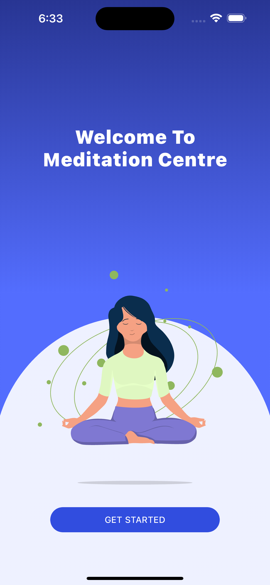
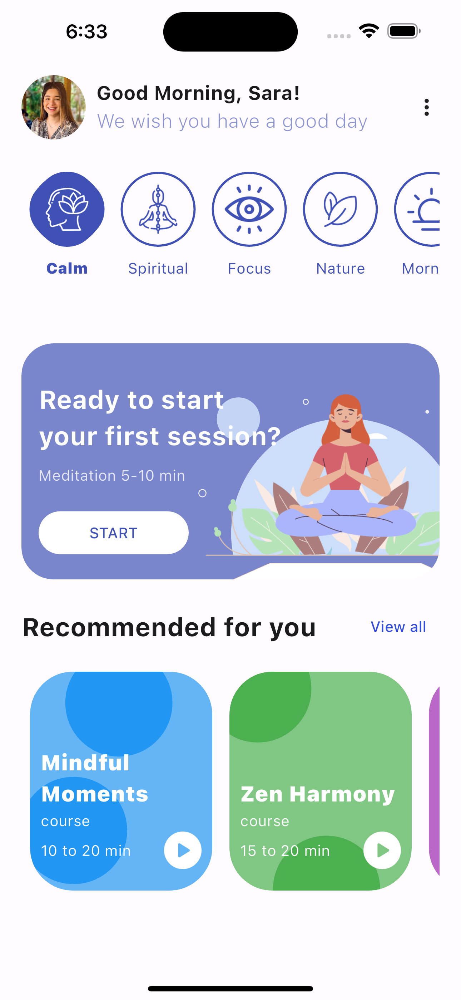
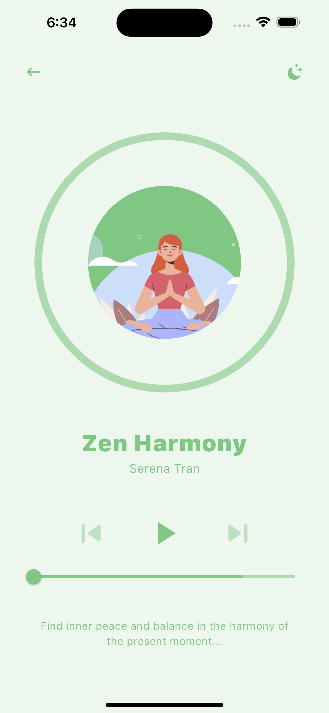
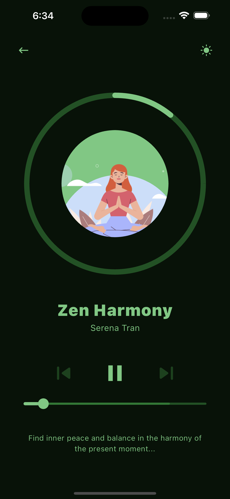

# meditation_app

A new Flutter project.

## Getting Started

This project is a starting point for a Flutter application.

A few resources to get you started if this is your first Flutter project:

- [Lab: Write your first Flutter app](https://docs.flutter.dev/get-started/codelab)
- [Cookbook: Useful Flutter samples](https://docs.flutter.dev/cookbook)

For help getting started with Flutter development, view the
[online documentation](https://docs.flutter.dev/), which offers tutorials,
samples, guidance on mobile development, and a full API reference.

# meditation-app

# file structure
    1. In this project clean architecture is used.
    2. Everything is in features folder.
    3. `data` folder contains the data like recommendation.
    4. `screens` this folder has all the UI
    5. `models` this folder has the model classes e.g. MoodModel